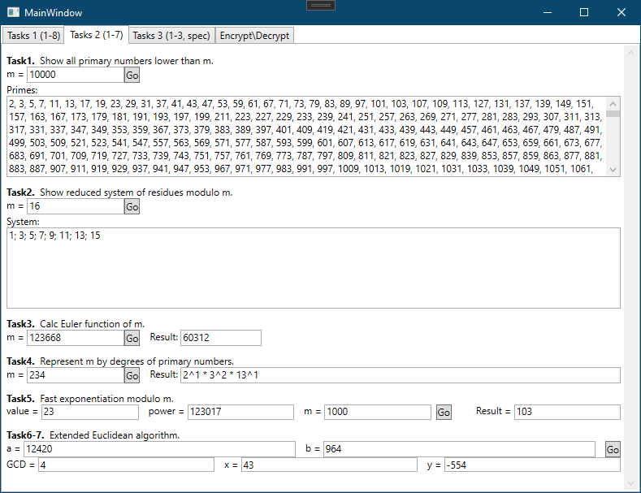

# ?

В данной программе реализованы алгоритмы шифрования Vernam, RC4, DES, RSA (не до конца), Rijndael, FROG (курсовая работа), а также мини-задачи, лежащие в основе этих алгоритмов.

## Проекты

* CryptographyLabs - сама программа.
* UnitTests - юнит-тесты алгоритмов шифрования.
* ConsoleTests - что-то вроде черновика.

# Примеры работы

Задачи к RSA:

Задачи к Rijndael:

Пример работы шифрования, дешифрования с использованием алгоритма FROG.

